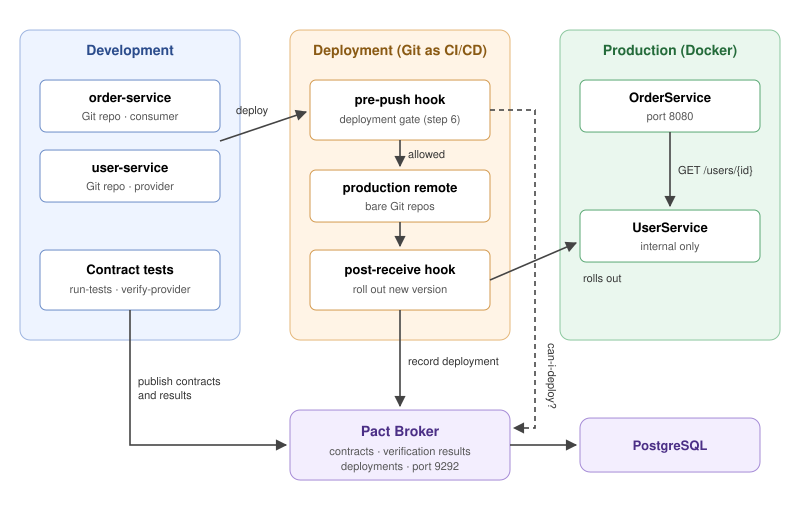

# Contract Testing: Pact and the Pact Broker

An executable tutorial on consumer-driven contract testing between microservices,
running entirely in the browser on Killercoda.

**▶ [Start the tutorial on Killercoda](https://killercoda.com/gabjea/scenario/contract-testing-pact)**

No installation needed, and no accounts besides a free Killercoda login.


## What you learn

After the tutorial, you can:

1. Explain why separate test suites for each service miss breaking API changes between
   them.
2. Write a consumer contract with Pact, and verify a provider against it.
3. Read the Pact Broker's compatibility matrix to tell which versions of two services
   work together.
4. Use `can-i-deploy` to decide whether, and in which order, versions can be deployed
   safely.

## What you do

A UserService renames a JSON field from `name` to `full_name`. Its own tests pass, the
OrderService tests pass, and production breaks anyway. Over nine steps, you:

| Step | What happens |
|---|---|
| 1. The breaking change | Deploy the rename, watch OrderService fail, roll back |
| 2. Write a consumer contract | Turn OrderService's expectations into a Pact contract |
| 3. Verify the provider | Check the real UserService against it, with provider states |
| 4. Share contracts through the Pact Broker | Publish the contract and the verification results |
| 5. The compatibility matrix | Verify 2 consumer versions against 3 provider versions |
| 6. Environments and can-i-deploy | Record production and add a deployment gate |
| 7. Expand | Deploy a UserService version that sends both fields |
| 8. Migrate | Move OrderService to the new field |
| 9. Contract | Remove the old field, and see the gate block an unsafe rollback |

Every step has an automated check, and every task has a solution, so the tutorial can be
completed from start to end.

## Architecture



Everything runs in Docker inside the Killercoda environment:

- **Two Python (Flask) services**, each in its own Git repository, as if owned by two
  teams. OrderService (the consumer) calls UserService (the provider).
- **The Pact Broker** with PostgreSQL, storing contracts, verification results and
  deployments.
- **Git as the CI/CD pipeline.** Deploying means pushing to a Git remote called
  `production`. A pre-push hook runs `can-i-deploy` as a deployment gate, and a
  post-receive hook rolls out the new version and records it in the broker.

## Repository structure

```
contract-testing-pact/           the Killercoda scenario
├── index.json                   scenario definition: steps, checks, assets
├── intro.md, finish.md          introduction and reflection
├── images/                      architecture diagram
├── setup/
│   ├── background.sh            builds the environment while the intro is read
│   └── foreground.sh            waits until setup is done
├── step1/ … step9/              text.md (instructions) and verify.sh (the CHECK button),
│                                plus a figure in some steps
└── assets/                      copied into the environment
    ├── src/                     service code, one folder per version
    │   ├── user-service/        1.0.0, 1.1.0, 2.0.0
    │   └── order-service/       1.0.0
    └── workshop/                becomes /root/workshop for the learner
        ├── docker-compose.yml   "production": broker, database, services
        ├── bin/                 helper commands (run-tests, verify-provider, deploy, ...)
        ├── hooks/               pre-push hook: the deployment gate
        ├── server-hooks/        post-receive hook: rollout and record-deployment
        ├── provider-states/     test data for provider states
        ├── skeletons/           the test file learners complete in step 2
        └── dev/                 image with pytest and pact-python
```

## How it works

- **Killercoda syncs from this repository.** Every push to `main` updates the scenario,
  through a deploy key and a webhook.
- **The service history is built at startup.** `setup/background.sh` turns each version
  folder in `assets/src/` into a Git commit and tag. Later versions only contain the
  files that changed. Each version is also built as a Docker image.
- **The helper commands wrap the real tools.** `pact-broker` is the official Pact Broker
  CLI and `verify-provider` uses the official Pact verifier, both run from their Docker
  images, so learners type the same commands they would use in a real pipeline.

## Tools used

[Pact](https://docs.pact.io) (pact-python and the Pact verifier), the
[Pact Broker](https://github.com/pact-foundation/pact_broker),
Docker Compose, Flask, pytest and [Killercoda](https://killercoda.com).