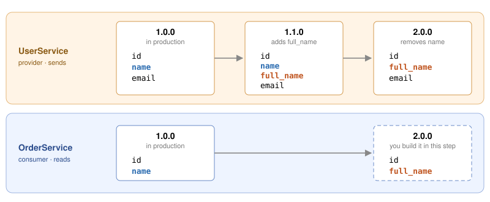

# The compatibility matrix

So far, there was one version of each service. In reality, both teams keep releasing,
and the question becomes: **which versions work together?** Here are the versions in
play:



UserService already has three versions. In this step, you build the missing piece:
**OrderService 2.0.0**, which reads `full_name`{{}} instead of `name`{{}}.

## Build OrderService 2.0.0

The OrderService team prepares for the rename on a feature branch:

`cd order-service && git switch -c use-full-name`{{exec}}

You need three changes:

1. **`user_client.py`{{}}**: read `full_name`{{}} from the response instead of `name`{{}}.
2. **`tests/test_user_client_pact.py`{{}}**: in the contract, expect `full_name`{{}}
   instead of `name`{{}}.
3. **`VERSION`{{}}**: change it to `2.0.0`{{}}.

<details>
<summary>Hint</summary>

In `user_client.py`, only the key in `data[...]` changes. The `User` class keeps its
field called `name`: that's OrderService's *internal* model, and it doesn't have to
match UserService's JSON.

In the test, only the key in the `with_body(...)` dictionary changes. The assertions on
`user.name` stay the same, for the same reason.

</details>

<details>
<summary>Solution</summary>

Click to apply all three changes:

```
sed -i 's/data\["name"\]/data["full_name"]/' user_client.py
sed -i 's/"name": match.str/"full_name": match.str/' tests/test_user_client_pact.py
echo 2.0.0 > VERSION
git diff
```{{exec}}

The diff shows exactly what changed:

- **`user_client.py`**: `User(id=data["id"], name=data["full_name"])`. OrderService now
  reads the new field from the response, but still stores it as `name` in its own
  `User` object, so the rest of OrderService doesn't change at all.
- **The contract** now says `"full_name": match.str(...)`. That's the consumer
  announcing its new expectation. Nothing else in the test changes, because the client
  still returns a `User` with a `name`.
- **`VERSION`** is 2.0.0, so the broker can tell the two contracts apart.

</details>

Run the tests, then commit:

`run-tests .`{{exec}}

`git add user_client.py tests VERSION && git commit -m "Read full_name from UserService"`{{exec}}

Go back to the workshop folder and publish the new contract, from its branch:

`cd .. && pact-broker publish order-service/pacts --consumer-app-version 2.0.0 --branch use-full-name`{{exec}}

OrderService 2.0.0 isn't released, it's still on a feature branch. Publishing anyway
is the point: the UserService team can see what's coming *before* it ships.

## Verify every UserService version

Verify all three UserService versions. Each run checks one UserService version against
**both** contracts (the latest from `main`{{}} and from `use-full-name`{{}}), and
publishes the results:

`for v in 1.0.0 1.1.0 2.0.0; do verify-provider $v; done`{{exec}}

Some verifications fail. That's expected: failed results are recorded too, and they're
just as useful.

## Read the matrix

`show-matrix`{{exec}}

Each cell answers: *do these two versions work together?* The broker has a web view of
the same data: add `/matrix/provider/UserService/consumer/OrderService`{{}} to the end
of the [Pact Broker]({{TRAFFIC_HOST1_9292}}) address.

Take a moment to read the grid:

- **OrderService 1.0.0** works with UserService 1.0.0 and 1.1.0, but not 2.0.0, which
  removed `name`{{}}. That's step 1's bug, now as a fact in the broker.
- **OrderService 2.0.0** works with UserService 1.1.0 and 2.0.0, but not 1.0.0, which
  doesn't have `full_name`{{}} yet.
- **UserService 1.1.0** is the only version that works with *both*.

There's no single "the API is compatible". **Compatibility is a property of a pair of
versions**, and the broker remembers every pair it has seen verified.

## Why does this matter?

Neither team had to coordinate in a meeting or wait for a shared test environment.
The consumer published its new expectation from a branch, the provider verified its
versions against it, and the result is a table both teams can read.

What the matrix doesn't tell you yet is **what's running in production**. Whether
UserService 2.0.0 can be deployed depends on which OrderService version is live. That's
the next step.

Click **CHECK** when all six combinations are verified.