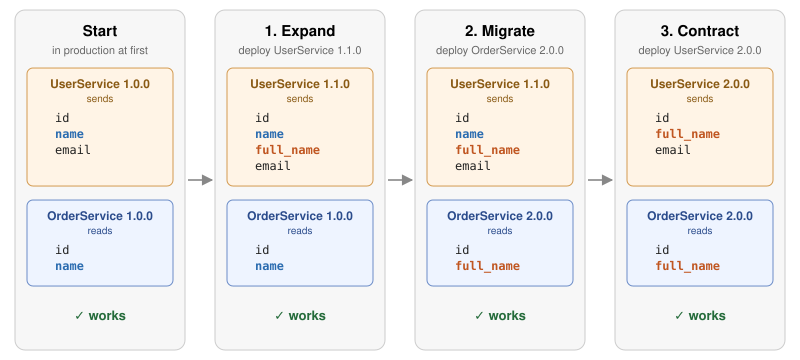

# Contract: remove the old field

Deploy UserService 2.0.0. It's the exact command that broke production in step 1:

`deploy user-service 2.0.0`{{exec}}

This time the gate lets it through, and production keeps working:

`curl -s localhost:8080/orders/1001; echo`{{exec}}

`cat .env`{{exec}}

The rename is done. Both services use `full_name`{{}}, and production never broke.

## The gate protects rollbacks too

Suppose OrderService 2.0.0 had a bug, and the team wanted to roll back to 1.0.0:

`deploy order-service 1.0.0`{{exec}}

**Blocked.** OrderService 1.0.0 reads `name`{{}}, which UserService 2.0.0 no longer
sends. Before the contract phase, this rollback would have been safe; now it isn't. A
gate that only knows "this worked yesterday" would have allowed it. The broker knows
what's in production *right now*.

## The whole release

In step 1, UserService jumped straight from the first column to 2.0.0 while
OrderService still read `name`{{}}. Released in three steps, every state in between was
verified to work:

1. **Expand.** The provider adds the new field next to the old one.
2. **Migrate.** Consumers switch to the new field, each on its own schedule.
3. **Contract.** Once no consumer in production uses the old field, the provider
   removes it.

## Why release a rename in three steps?

This pattern is known as **expand and contract** (or *parallel change*). It's the
standard way to make breaking changes without downtime, and it applies far beyond
JSON fields: database schemas, message formats, and configuration files are migrated
the same way.

It has a cost: three releases instead of one, and for a while the provider sends the
same data twice. In return, **no team ever has to deploy in lockstep with another**,
which is exactly what independent deployment requires.

Contract testing doesn't invent this pattern. What it adds is certainty: at each step,
`can-i-deploy`{{}} told you whether the next release was safe, based on verified
contracts and on what was actually running, instead of on memory or a checklist.

Click **CHECK** when UserService 2.0.0 is in production.